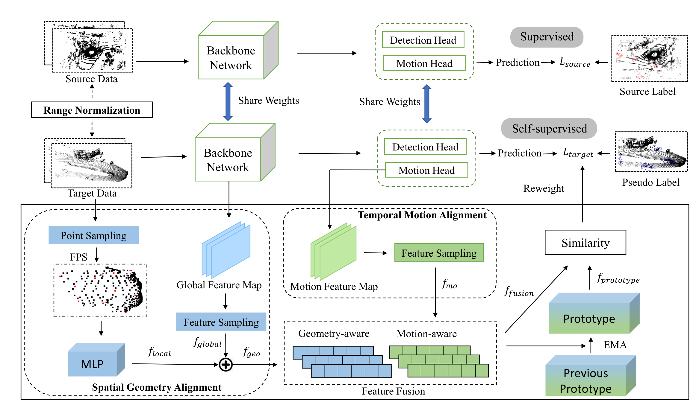

# CL3D: Unsupervised Domain Adaptation for Cross-LiDAR 3D Detection
The source code of our work "CL3D: Unsupervised Domain Adaptation for Cross-LiDAR 3D Detection", accepted to AAAI 2023

<p float="center">
  
</p>

## License
This code is distributed under an [MIT LICENSE](LICENSE).

## Reference

If you find our work useful in your research, please consider citing our [paper](https://arxiv.org/pdf/2212.00244.pdf):
```
@inproceedings{peng2023cl3d,
  title={Cl3d: Unsupervised domain adaptation for cross-lidar 3d detection},
  author={Peng, Xidong and Zhu, Xinge and Ma, Yuexin},
  booktitle={Proceedings of the AAAI Conference on Artificial Intelligence},
  volume={37},
  number={2},
  pages={2047--2055},
  year={2023}
}
```
